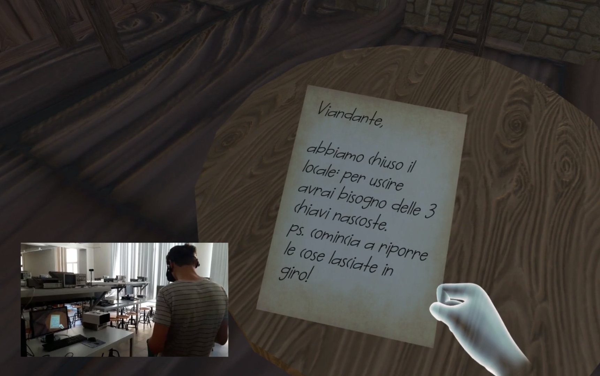

# Escape-Room-VR
In this project, a 3D game based on VR with Oculus Rift has been developed using Unity for scene modeling and scripting in C#. 
The game is articulated in three levels that can be passed following some hidden clues.
A complete gameplay video can be viewed at this [link](http://www.micc.unifi.it/berretti/images/EscapeRoomVR.mp4).

Are you able to escape from a locket Inn?

